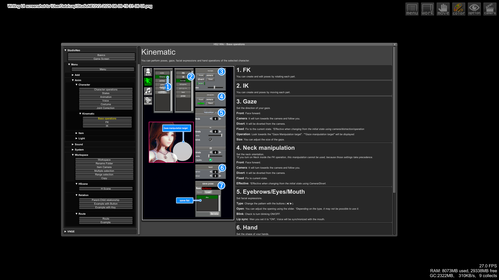

# HS2 Wiki Plugin

[](https://github.com/SuitIThub/HS2Wiki/releases/latest)
[](https://opensource.org/licenses/MIT)
[](https://github.com/BepInEx/BepInEx)

A plugin for Honey Select 2 that provides an in-game wiki system. This plugin allows other plugins to register and display wiki pages to help users understand game features.



## Features

- In-game wiki accessible via a hotkey (default: F3)
- Category-based organization of wiki pages
- Support for text, buttons, and images in wiki pages
- Scrollable content for detailed documentation

## Installation

1. Ensure you have [BepInEx](https://github.com/BepInEx/BepInEx) installed
2. Place the `HS2Wiki.dll` in your `BepInEx/plugins` folder

## Usage

Press F3 (configurable) to open the wiki panel.

## For Plugin Developers: How to Register Wiki Pages

You can add your own wiki pages to the central wiki system by following these steps:

### 1. Register your wiki page

Use the public API to register your wiki pages. The simplest approach is:

```csharp
// Inside your plugin's Awake or Start method
RegisterWikiPage("Your Category", "Your Page Name", YourDrawPageMethod);

// Use this method to connect to the wiki plugin
private void RegisterWikiPage(string category, string pageName, Action drawPageAction)
{
    Type wikiPluginType = Type.GetType("HS2Wiki.WikiPlugin, HS2Wiki");
    if (wikiPluginType == null)
    {
        Logger.LogWarning("Wiki plugin not found - registration skipped.");
        return;
    }

    // Try to find the PublicAPI field
    FieldInfo apiField = wikiPluginType.GetField("PublicAPI", BindingFlags.Public | BindingFlags.Static);
    if (apiField == null)
    {
        Logger.LogWarning("Wiki API field not found - registration skipped.");
        return;
    }

    object apiInstance = apiField.GetValue(null);
    if (apiInstance == null)
    {
        Logger.LogWarning("Wiki API is null - registration skipped.");
        return;
    }

    // Try to find the RegisterPage method
    MethodInfo registerPageMethod = apiInstance.GetType().GetMethod("RegisterPage", new[] {
        typeof(string), typeof(string), typeof(Action)
    });

    if (registerPageMethod == null)
    {
        Logger.LogWarning("RegisterPage method not found.");
        return;
    }

    // Call up RegisterPage
    registerPageMethod.Invoke(apiInstance, new object[] {
        category,
        pageName,
        drawPageAction
    });

    Logger.LogInfo("Page successfully registered with the wiki.");
}

// Define the method that will draw your wiki page content
private void YourDrawPageMethod()
{
    // Use Unity's IMGUI to create your page content
    GUILayout.Label("Your wiki content goes here");
    
    // You can use rich text
    GUILayout.Label("<b>Bold text</b> and <color=yellow>colored text</color>");
    
    // Add buttons
    if (GUILayout.Button("Click Me"))
    {
        // Handle button click
    }
    
    // Add images
    if (yourTexture != null)
    {
        GUILayout.Box(yourTexture, GUILayout.Width(200), GUILayout.Height(200));
    }
}
```

### 2. Content Guidelines

Your wiki page can include:

- Text (including rich text with HTML tags)
- Buttons with clickable actions
- Images (Texture2D objects)
- Scrollable content (the wiki system handles scrolling automatically)

But pretty much everything Unity's GUI System can handle, can be included into your page :D

It is good practice to use your pulgins title to prevent duplicate categories.

### 3. Example

Here's a complete example of how to register and implement a wiki page:

```csharp
using BepInEx;
using UnityEngine;

[BepInPlugin("com.yourname.yourplugin", "Your Plugin", "1.0.0")]
[BepInDependency("com.suit.hs2wiki", BepInDependency.DependencyFlags.HardDependency)]
public class YourPlugin : BaseUnityPlugin
{
    private Texture2D _exampleImage;

    private void Awake()
    {
        // Check if the Wiki plugin is available
        if (WikiPlugin.PublicAPI != null)
        {
            // Load your image
            _exampleImage = LoadYourImage();
            
            // Register your wiki page
            RegisterWikiPage("Category", "Feature Guide", DrawWikiPage);
        }
    }
    
    private void RegisterWikiPage(string category, string pageName, Action drawPageAction)
{
    Type wikiPluginType = Type.GetType("HS2Wiki.WikiPlugin, HS2Wiki");
    if (wikiPluginType == null)
    {
        Logger.LogWarning("Wiki plugin not found - registration skipped.");
        return;
    }

    // Try to find the PublicAPI field
    FieldInfo apiField = wikiPluginType.GetField("PublicAPI", BindingFlags.Public | BindingFlags.Static);
    if (apiField == null)
    {
        Logger.LogWarning("Wiki API field not found - registration skipped.");
        return;
    }

    object apiInstance = apiField.GetValue(null);
    if (apiInstance == null)
    {
        Logger.LogWarning("Wiki API is null - registration skipped.");
        return;
    }

    // Try to find the RegisterPage method
    MethodInfo registerPageMethod = apiInstance.GetType().GetMethod("RegisterPage", new[] {
        typeof(string), typeof(string), typeof(Action)
    });

    if (registerPageMethod == null)
    {
        Logger.LogWarning("RegisterPage method not found.");
        return;
    }

    // Call up RegisterPage
    registerPageMethod.Invoke(apiInstance, new object[] {
        category,
        pageName,
        drawPageAction
    });

    Logger.LogInfo("Page successfully registered with the wiki.");
}

    private void DrawWikiPage()
    {
        GUILayout.Label("<b>Your Feature Guide</b>");
        GUILayout.Space(10);
        
        GUILayout.Label("This is how to use your feature:");
        GUILayout.Label("1. First step");
        GUILayout.Label("2. Second step");
        
        if (GUILayout.Button("Show More Details"))
        {
            // Handle button click
        }
        
        if (_exampleImage != null)
        {
            GUILayout.Label("Screenshot:");
            GUILayout.Box(_exampleImage, GUILayout.Width(300), GUILayout.Height(200));
        }
    }
    
    private Texture2D LoadYourImage()
    {
        // Your image loading code
        // ...
    }
}
```

## Tips for Wiki Content

- Keep your wiki content organized by categories
- Use clear, descriptive page names
- Include visual examples when possible
- For complex features, consider adding step-by-step guides
- Test your wiki pages to ensure they display correctly

## License

This project is licensed under the MIT License - see the [LICENSE](LICENSE) file for details.

## Credits

Developed by Suit-Ji
